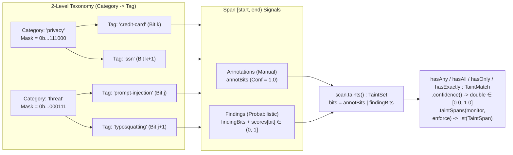

# CEL Content Classification & Taint Tracking Extension (`ext/classify`) Design

## 1. Overview

The `ext/classify` Go submodule (`cel.dev/cel-go/ext/classify`) provides a content scanning, structural extraction, and bitset-based taint propagation framework for Common Expression Language (CEL) policies and Go applications, building on the **CEL AI Attributes & Policy Authoring** architecture (`cel.expr.ai`, [cel-spec#509](https://github.com/google/cel-spec/pull/509)).

`ext/classify` organizes all security, privacy, safety, and structural signals into a two-level **`category` + `tag`** taxonomy (for example, `category: 'privacy'`, `tag: 'credit-card'`, or `category: 'threat'`, `tag: 'prompt-injection'`) and models them through three composable primitives:

1. **`Annotations` (Manual / Deterministic, Confidence = `1.0`)**:
   Explicitly asserted or deterministically parsed `(category, tag)` or category-only properties of a content range—such as manually asserted privacy tags (where a `:`-delimited string like `'privacy:credit-card'` denotes `category:tag` and a plain string like `'privacy'` denotes `category` only), or MCP tool hints (`capability:open-world`, `capability:destructive`). Annotations have absolute confidence (`1.0`). (Document metadata, reviewer identity, dates, and governance tags are handled orthogonally via `content.verified` and exposed via first-class **`labels`** on `Content`).
2. **`Findings` (Probabilistic Classifications, Confidence $\in [0.0, 1.0]$)**:
   Likelihood scores produced for a `(category, tag)` over text chunks or URI spans by probabilistic classifiers (**ShieldGemma**, **Cloud ModelArmor**, **Jev**, valid-domain typosquatting scorers, or custom user classification APIs)—such as `threat:prompt-injection`, `threat:typosquatting`, `privacy:credit-card`, or `safety:hate-speech`.
3. **`Taints` (Bitset + Confidence Vector Propagated with Input Spans)**:
   The unified taint state (`TaintSet`) combining `annotations` (confidence `1.0`) and `findings` (confidence $\in (0.0, 1.0]$). Every leaf `(category, tag)` maps to a single bit position, and every **`category`** maps to the bitwise OR mask of all its registered **`tag`** bits. Querying `scan.taints().hasAny(...)` or `scan.taints().hasAll(...)` performs $O(1)$ bitmask filtering and exposes `.confidence()` so policies can compare against monitoring or enforcement thresholds naturally:
   ```cel
   scan.taints().hasAny(['privacy:credit-card', 'privacy:ssn']).confidence() >= 0.70
   ```

---

## 2. Core Conceptual Model: `Category` / `Tag` Hierarchy & Probabilistic Bitsets



### 2.1. Bitset-Backed `TaintSet` and `TaintMatch.confidence()`

Rather than forcing callers to pass a threshold into `taints(threshold)` up front—which would require re-computing bitsets for every distinct threshold in a policy—`scan.taints()` returns the complete `TaintSet` for the scanned content, consisting of:
- `bits` (`BitSet`): All active bits (`annotBits | findingBits`).
- `annotBits` (`BitSet`): Bits set deterministically by manual annotations (implicitly confidence `1.0`).
- `scores`: Max-merged confidence scores $C_b \in (0.0, 1.0]$ for active finding bits.

Set queries on `TaintSet` (`hasAny`, `hasAll`, `hasOnly`, `hasExactly`) return a `TaintMatch` whose `.confidence()` method computes the exact probabilistic confidence using fuzzy/probabilistic logic with $O(1)$ bitwise short-circuiting:

1. **`taints.hasAny(targets).confidence()` (Disjunction / Max Confidence)**:
   - Represents the likelihood that **at least one** of the specified categories or tags is present:
     $$\text{confidence}\big(\text{hasAny}(M)\big) = \max_{b \in M} \text{conf}(b)$$
   - **Fast Paths**:
     - If `(taints.bits & M) == 0`, returns `0.0` immediately in **1 bitwise AND instruction**.
     - If `(taints.annotBits & M) != 0`, returns `1.0` immediately in **1 bitwise AND instruction** (since a manual annotation in $M$ is present with confidence `1.0`).
     - Otherwise, iterates only over the set bits in `taints.bits & M` (via hardware `TrailingZeros64`) and returns the maximum finding score.

2. **`taints.hasAll(targets).confidence()` (Conjunction / Min Confidence)**:
   - Represents the joint likelihood that **all** required categories or tags $M = \{m_1, \dots, m_k\}$ are simultaneously present:
     $$\text{confidence}\big(\text{hasAll}(M)\big) = \min_{i \in \{1..k\}} \text{conf}\big(\text{hasAny}(m_i)\big)$$
   - **Fast Path**:
     - If for any $m_i$, `(taints.bits & m_i) == 0`, returns `0.0` immediately.
     - Note how cleanly manual annotations and probabilistic findings compose: if `'capability:open-world'` is a manual annotation (`1.0`) and `'threat:prompt-injection'` is a finding at `0.88`, then:
       ```cel
       scan.taints().hasAll(['capability:open-world', 'threat:prompt-injection']).confidence()
       // evaluates to min(1.0, 0.88) == 0.88
       ```

3. **`taints.hasOnly(targets).confidence()` (Subset / Allowed-Only Membership)**:
   - Verifies that **no bits outside $M$** are active (`(taints.bits & ^M) == 0`) and **at least one** bit in $M$ is active:
     - If `(taints.bits & ^M) != 0` or `(taints.bits & M) == 0`, returns `0.0` in $O(1)$; otherwise returns `taints.hasAny(M).confidence()`.

4. **`taints.hasExactly(targets).confidence()` (Exact Set Equality)**:
   - Verifies that **all** required targets $M = \{m_1, \dots, m_k\}$ are present (`hasAll(M)`) **and no bits outside $M$** are active (`(taints.bits & ^M) == 0`):
     - If `(taints.bits & ^M) != 0`, returns `0.0` in $O(1)$; otherwise returns `taints.hasAll(M).confidence()`.

### 2.2. Why Bind `TaintMatch` Once for Monitor vs. Enforce?

Because `hasAny` and `hasAll` return a `TaintMatch` object before thresholding, a policy can define a single variable for a concern and compare `.confidence()` against both its **monitoring** threshold and its **enforcement** threshold without repeating the query:

```yaml
variables:
  - threat_check: >
      scan.taints().hasAny(['threat', 'safety'])
  - financial_pii_check: >
      scan.taints().hasAny(['privacy:credit-card', 'privacy:ssn'])

rules:
  - condition: >
      variables.threat_check.confidence() >= 0.85 ||
      variables.financial_pii_check.confidence() >= 0.70
    effect: deny
  - condition: >
      variables.threat_check.confidence() >= 0.50 ||
      variables.financial_pii_check.confidence() >= 0.40
    effect: confirm
```

Furthermore, `variables.threat_check.taintSpans(0.50, 0.85)` extracts only the character offset ranges (`list(classify.TaintSpan)`) that contributed to `threat_check`, whereas `variables.scan.taintSpans(0.50, 0.85)` returns all attributed taint spans across the entire `Content` document. Raw text ranges for links, images, code blocks, or taint spans are inspected using standard CEL `content.body.substring(span.start, span.stop)`.

---

## 3. Policy Taxonomy & Model Output Mappings

Content security policies must express rules in a uniform, model-agnostic vocabulary without caring whether a finding was detected by an on-device model (ShieldGemma, Llama Guard), a cloud security API (Google Cloud Model Armor, OpenAI Moderation, Jev), or LLM refusal tags (Anthropic Claude, DeepSeek, Kimi).

`ext/classify` establishes a **Policy Taxonomy** that groups all security, safety, privacy, and capability signals into standard **`category`** and **`category:tag`** bitset identifiers. Model-independent metadata and attestations (such as reviewer identity, review dates, bug IDs, or document labels) are decoupled from probabilistic classifications and represented as first-class fields on `content.verified` and queried via `content.labels()`.

### 3.1. Canonical Policy Taxonomy

| Category | Tag | Canonical ID (`category:tag`) | Type | Canonical Description / Scope |
| :--- | :--- | :--- | :--- | :--- |
| **`threat`** | `prompt-injection` | `threat:prompt-injection` | **Finding** | Indirect/direct system prompt overrides, delimiter attacks, goal hijacking |
| | `jailbreak` | `threat:jailbreak` | **Finding** | Adversarial personas, roleplay bypasses, base64/rot13 obfuscation |
| | `typosquatting` | `threat:typosquatting` | **Finding** | Lookalike/confusable domains targeting trusted hosts (homoglyphs, omissions) |
| | `malicious-uri` | `threat:malicious-uri` | **Finding** / **Annotation** | Phishing hosts, malicious domains, dangerous URI schemes (`javascript:`, `data:`) |
| | `exploit` | `threat:exploit` | **Finding** | Shell injections, command execution payloads, memory corruption triggers |
| | `cyberattack` | `threat:cyberattack` | **Finding** | Malware synthesis, vulnerability weaponization, DDoS/reconnaissance instructions |
| | `cbrn` | `threat:cbrn` | **Finding** | Chemical, biological, radiological, or nuclear weapons synthesis |
| | `frontmatter-injection` | `threat:frontmatter-injection` | **Finding** / **Annotation** | Suspicious YAML directives, hidden code tags, or frontmatter delimiter spoofing |
| **`safety`** | `hate-speech` | `safety:hate-speech` | **Finding** | Discrimination, disparagement, or incitement of hatred against protected traits |
| | `harassment` | `safety:harassment` | **Finding** | Bullying, stalking, intimidation, sexual harassment, or abusive insults |
| | `sexual` | `safety:sexual` | **Finding** | Non-consensual sexual content, explicit erotic depictions, solicitation |
| | `child-safety` | `safety:child-safety` | **Finding** | CSAM / CSAS or child sexual exploitation and abuse |
| | `violence` | `safety:violence` | **Finding** | Graphic gore, weapons violence, real-world physical assault incitement |
| | `self-harm` | `safety:self-harm` | **Finding** | Suicide instructions, self-injury promotion, or eating disorder encouragement |
| | `defamation` | `safety:defamation` | **Finding** | False factual statements damaging individual or organizational reputations |
| **`privacy`** | `credit-card` | `privacy:credit-card` | **Finding** / **Annotation** | Payment card numbers (PAN) verified via Luhn check |
| | `ssn` | `privacy:ssn` | **Finding** / **Annotation** | Social Security and national identity numbers |
| | `phone-number` | `privacy:phone-number` | **Finding** / **Annotation** | E.164 and local formatted telephone numbers |
| | `email` | `privacy:email` | **Finding** / **Annotation** | Validated email address patterns |
| | `secret-key` | `privacy:secret-key` | **Finding** / **Annotation** | Cryptographic keys, API tokens, passwords, bearer credentials |
| | `pii` | `privacy:pii` | **Finding** / **Annotation** | General personal data when a specific subtype tag is unavailable |
| **`capability`** | `open-world` | `capability:open-world` | **Annotation** (`1.0`) | Tool or operation accesses external networks or untrusted endpoints |
| | `destructive` | `capability:destructive` | **Annotation** (`1.0`) | Tool or operation mutates persistent state, drops tables, or deletes data |

---

### 3.2. Concrete Model Output Mapping Specifications

Each model adapter implements the `Classifier` interface, receiving content chunks and outputting canonical `Finding` structs with `[0.0, 1.0]` confidences and character `Span` ranges:

#### 1. Google Cloud Model Armor
- **Architecture**: Managed security perimeter evaluating LLM prompts and responses against Responsible AI (RAI), Sensitive Data Protection (SDP), and prompt safety filters.
- **Output Inspection**: Model Armor returns a `SanitizeUserPromptResponse` or `SanitizeModelResponse` containing `filter_results`:
  - `rai_filter_result`: Contains `hate_speech_confidence`, `harassment_confidence`, `sexual_confidence`, `violence_confidence`.
  - `pi_and_jailbreak_filter_result`: Contains `confidence_level` (enum: `LOW`, `MEDIUM`, `HIGH`) and match likelihood $\in [0.0, 1.0]$.
  - `sdp_filter_result`: Returns matched InfoTypes (`CREDIT_CARD_NUMBER`, `US_SOCIAL_SECURITY_NUMBER`, `EMAIL_ADDRESS`, `PHONE_NUMBER`, `AUTH_TOKEN`, `PRIVATE_KEY`) with byte offset ranges.
  - `malicious_uri_filter_result`: Returns flags for phishing and malware domains with matched substring ranges.
- **Concrete Mapping**:
  - `pi_and_jailbreak_filter_result` $\rightarrow$ `threat:prompt-injection` & `threat:jailbreak` (confidence from score).
  - `malicious_uri_filter_result` $\rightarrow$ `threat:malicious-uri` (confidence = `1.0` if blocked, or raw risk score).
  - `rai_filter_result.hate_speech_confidence` $\rightarrow$ `safety:hate-speech`.
  - `rai_filter_result.harassment_confidence` $\rightarrow$ `safety:harassment`.
  - `rai_filter_result.sexual_confidence` $\rightarrow$ `safety:sexual`.
  - `rai_filter_result.violence_confidence` $\rightarrow$ `safety:violence`.
  - `sdp_filter_result` InfoTypes $\rightarrow$ mapped to `privacy:credit-card`, `privacy:ssn`, `privacy:email`, `privacy:phone-number`, or `privacy:secret-key` with exact character `Span` bounds.

#### 2. Google ShieldGemma
- **Architecture**: Open safety model family (2B, 9B, 27B) fine-tuned on Gemma to evaluate text against four standard safety guidelines.
- **Output Inspection**: ShieldGemma produces binary "Yes"/"No" tokens with next-token probability distribution over logits:
  $$P(\text{"Yes"}) = \frac{e^{z_{\text{Yes}}}}{e^{z_{\text{Yes}}} + e^{z_{\text{No}}}}$$
- **Concrete Mapping**:
  - Guideline 1 ("Hate Speech") $\rightarrow$ `safety:hate-speech` ($P(\text{"Yes"})$ as confidence).
  - Guideline 2 ("Harassment") $\rightarrow$ `safety:harassment` ($P(\text{"Yes"})$ as confidence).
  - Guideline 3 ("Sexually Explicit") $\rightarrow$ `safety:sexual` ($P(\text{"Yes"})$ as confidence).
  - Guideline 4 ("Dangerous Content") $\rightarrow$ emits `threat:exploit`, `threat:cyberattack`, `threat:cbrn`, and `safety:violence` based on sub-prompt guidelines, or aggregates to `threat` category.

#### 3. Meta Llama Guard (Llama Guard 2 / 3)
- **Architecture**: Safety classifier aligned with the MLCommons AI Safety taxonomy, outputting `safe` or `unsafe\n<hazard_code>` (e.g. `unsafe\nS1,S13`).
- **Output Inspection**: The adapter parses output lines; for `unsafe`, it extracts each comma-separated hazard code `S1`–`S14`. If log probabilities are returned, confidence is the sequence probability; otherwise default unsafe confidence is `1.0`.
- **Concrete Mapping**:
  - `S1: Violent Crimes` $\rightarrow$ `safety:violence`
  - `S2: Non-Violent Crimes / Hate Speech` $\rightarrow$ `safety:hate-speech`
  - `S3: Sex-Related Crimes / Sexual Content` $\rightarrow$ `safety:sexual`
  - `S4: Child Sexual Exploitation and Abuse` $\rightarrow$ `safety:child-safety`
  - `S5: Defamation` $\rightarrow$ `safety:defamation`
  - `S6: Suicide & Self-Harm` $\rightarrow$ `safety:self-harm`
  - `S8: Harassment` $\rightarrow$ `safety:harassment`
  - `S9: Software Vulnerabilities / Attacks` $\rightarrow$ `threat:cyberattack` & `threat:exploit`
  - `S10: CBRN Weapons` $\rightarrow$ `threat:cbrn`
  - `S12: Privacy / PII Violations` $\rightarrow$ `privacy:pii`
  - `S13: Defiance / Jailbreak / Prompt Injection` $\rightarrow$ `threat:jailbreak` & `threat:prompt-injection`

#### 4. OpenAI Moderation API (`omni-moderation-latest` / `text-moderation-007`)
- **Architecture**: Multi-label classifier returning a JSON object with boolean flags (`categories`) and floating-point confidence scores $\in [0.0, 1.0]$ (`category_scores`).
- **Output Inspection**: Direct JSON field extraction from `category_scores`:
- **Concrete Mapping**:
  - `category_scores["hate"]` & `category_scores["hate/threatening"]` $\rightarrow$ `safety:hate-speech` ($\max(\text{scores})$).
  - `category_scores["harassment"]` & `category_scores["harassment/threatening"]` $\rightarrow$ `safety:harassment` ($\max(\text{scores})$).
  - `category_scores["sexual"]` $\rightarrow$ `safety:sexual`.
  - `category_scores["sexual/minors"]` $\rightarrow$ `safety:child-safety`.
  - `category_scores["self-harm"]`, `category_scores["self-harm/intent"]`, `category_scores["self-harm/instructions"]` $\rightarrow$ `safety:self-harm` ($\max(\text{scores})$).
  - `category_scores["violence"]` & `category_scores["violence/graphic"]` $\rightarrow$ `safety:violence` ($\max(\text{scores})$).
  - `category_scores["illicit"]` & `category_scores["illicit/violent"]` $\rightarrow$ `threat:exploit` & `threat:cyberattack`.

#### 5. Anthropic Claude (Refusals & Structured Guardrails)
- **Architecture**: Claude classifies harmful requests via system prompt alignment, refusal stop reasons (`stop_reason: "refusal"`), and JSON-schema output parsing.
- **Output Inspection**:
  - When invoked with a safety assessment tool or JSON schema, Claude returns structured hazard classifications:
    `{"harm_category": "prompt_injection" | "cbrn" | "cyberattack" | "sexual" | "hate", "confidence": float, "span": [start, end]}`.
  - When evaluating raw model responses, refusal preambles (e.g. *"I cannot fulfill this request because it involves cyberattacks..."*) are matched by regex against Anthropic's Acceptable Use Policy categories.
- **Concrete Mapping**:
  - `harm_category == "prompt_injection"` $\rightarrow$ `threat:prompt-injection`.
  - `harm_category == "jailbreak"` $\rightarrow$ `threat:jailbreak`.
  - `harm_category == "cyberattack"` or malware synthesis $\rightarrow$ `threat:cyberattack`.
  - `harm_category == "cbrn"` $\rightarrow$ `threat:cbrn`.
  - `harm_category == "hate"` $\rightarrow$ `safety:hate-speech`.
  - `harm_category == "harassment"` $\rightarrow$ `safety:harassment`.
  - `harm_category == "sexual"` $\rightarrow$ `safety:sexual`.
  - `harm_category == "child_exploitation"` $\rightarrow$ `safety:child-safety`.

#### 6. DeepSeek (DeepSeek Guard / Safety Alignment)
- **Architecture**: Content moderation filters and safety pre-prompts accompanying DeepSeek-V3 / R1 reasoning traces, outputting safety tags or refusal categories.
- **Output Inspection**: Evaluates structured tags in JSON responses or safety refusal prefixes:
  - System prompt overrides $\rightarrow$ `threat:prompt-injection`.
  - Adversarial jailbreaks $\rightarrow$ `threat:jailbreak`.
  - Vulnerability weaponization and script exploit payloads $\rightarrow$ `threat:exploit`.
  - Malware synthesis $\rightarrow$ `threat:cyberattack`.
  - Sensitive personal data exfiltration $\rightarrow$ `privacy:pii`.
  - Hate speech, harassment, pornographic content $\rightarrow$ `safety:hate-speech`, `safety:harassment`, `safety:sexual`.

#### 7. Kimi (Moonshot AI Safety)
- **Architecture**: Moonshot / Kimi safety assessment API and agent guardrails designed for long-context Chinese and multilingual safety filtering.
- **Output Inspection**: Returns structured inspection status with `violation_type` and `risk_level` (`low`, `medium`, `high`, `extreme` mapped to `0.25`, `0.50`, `0.75`, `1.0`):
- **Concrete Mapping**:
  - `prompt_attack` / `system_override` $\rightarrow$ `threat:prompt-injection`.
  - `jailbreak_bypass` $\rightarrow$ `threat:jailbreak`.
  - `malicious_code` / `vulnerability_exploit` $\rightarrow$ `threat:exploit`.
  - `network_attack` $\rightarrow$ `threat:cyberattack`.
  - `privacy_infringement` / `personal_data` $\rightarrow$ `privacy:pii`.
  - `toxic_speech` / `harassment` $\rightarrow$ `safety:harassment` & `safety:hate-speech`.
  - `pornography` / `vulgarity` $\rightarrow$ `safety:sexual`.

#### 8. Jev (Exploit & Security Payload Engine)
- **Architecture**: Specialized deep-packet and text chunk scanner for security vulnerabilities, shell payloads, and code injection attacks.
- **Output Inspection**: Scans tokens for regex patterns and AST signatures of CVEs, SQL injections, shell escapes, prototype pollution, and frontmatter masquerades. Returns matched byte intervals and certainty $\in [0.80, 1.0]$.
- **Concrete Mapping**:
  - Shell / binary / code injection signatures $\rightarrow$ `threat:exploit` (confidence from Jev match score).
  - Suspicious YAML/Markdown delimiter injection $\rightarrow$ `threat:frontmatter-injection`.
  - Known exploit URIs and command-and-control endpoints $\rightarrow$ `threat:malicious-uri`.

---

### 3.3. Cross-Model Mapping Matrix

| Canonical ID (`category:tag`) | Cloud Model Armor (Google) | ShieldGemma (Google) | Llama Guard (Meta / MLCommons) | OpenAI Moderation API | Anthropic Claude (Refusal / Schema) | DeepSeek (Guard / Refusal) | Kimi (Moonshot Safety) | Jev Exploit Engine |
| :--- | :--- | :--- | :--- | :--- | :--- | :--- | :--- | :--- |
| **`threat:prompt-injection`** | `PI_AND_JAILBREAK` | `Dangerous Content` / Custom | `S13: Defiance / Jailbreak` | — | `prompt_injection` | System prompt override | `prompt_attack` | Prompt override signature |
| **`threat:jailbreak`** | `PI_AND_JAILBREAK` | `Dangerous Content` | `S13: Defiance / Jailbreak` | `illicit` | `jailbreak` | Refusal: `jailbreak` | `jailbreak_bypass` | Obfuscation bypass |
| **`threat:typosquatting`** | URI / Domain filter | — | — | — | — | — | — | Domain lookalike engine |
| **`threat:malicious-uri`** | Malicious URI filter | — | — | — | Phishing / malicious link | Malicious URL | Malicious link | Known C2 / malicious URI |
| **`threat:exploit`** | Vulnerability filter | `Dangerous Content` | `S9: Software Vulnerabilities` | `illicit` | Exploit payload advice | Code exploit refusal | `vulnerability_exploit` | AST / payload scanner |
| **`threat:cyberattack`** | Cyber threat filter | `Dangerous Content` | `S9: Software Vulnerabilities` | `illicit/violent` | Cyberattacks & malware | Malware / cyber attack | `network_attack` | Exploit weaponization |
| **`threat:cbrn`** | CBRN filter | `Dangerous Content` | `S10: CBRN Weapons` | `illicit/violent` | CBRN materials | CBRN materials | CBRN dangerous goods | — |
| **`threat:frontmatter-injection`**| Suspicious frontmatter | — | — | — | Delimiter spoofing | Delimiter injection | Directive injection | Frontmatter AST scanner |
| **`safety:hate-speech`** | `Hate Speech` (RAI) | `Hate Speech` | `S2: Hate Speech` | `hate`, `hate/threatening` | Hate speech / discrimination | Hate speech | `toxic_speech` | — |
| **`safety:harassment`** | `Harassment` (RAI) | `Harassment` | `S8: Harassment` | `harassment`, `harassment/threatening` | Harassment / bullying | Harassment | `harassment` | — |
| **`safety:sexual`** | `Sexually Explicit` (RAI) | `Sexually Explicit` | `S3: Sexual Content` | `sexual` | Sexual content | Sexually explicit | `pornography` | — |
| **`safety:child-safety`** | CSAM filter | `Child Safety` | `S4: Child Sexual Abuse` | `sexual/minors` | Child sexual exploitation | Child safety / CSAM | Child safety / CSAM | — |
| **`safety:violence`** | `Violence` (RAI) | `Dangerous Content` | `S1: Violent Crimes` | `violence`, `violence/graphic` | Graphic violence & gore | Violence & crimes | Violence | — |
| **`safety:self-harm`** | `Self Harm` (RAI) | `Dangerous Content` | `S6: Suicide & Self-Harm` | `self-harm/*` | Suicide & self-harm | Self-harm | Suicide & self-harm | — |
| **`safety:defamation`** | Defamation filter | — | `S5: Defamation` | — | Defamation | Defamation | Defamation | — |
| **`privacy:credit-card`** | SDP: `CREDIT_CARD_NUMBER` | — | `S12: PII / Privacy` | — | — | — | — | Luhn pattern scanner |
| **`privacy:ssn`** | SDP: `US_SOCIAL_SECURITY_NUMBER` | — | `S12: PII / Privacy` | — | — | — | — | Regex / SDP detector |
| **`privacy:phone-number`** | SDP: `PHONE_NUMBER` | — | `S12: PII / Privacy` | — | — | — | — | Phone regex detector |
| **`privacy:email`** | SDP: `EMAIL_ADDRESS` | — | `S12: PII / Privacy` | — | — | — | — | Email regex detector |
| **`privacy:secret-key`** | SDP: `AUTH_TOKEN`, `PRIVATE_KEY` | — | `S12: PII / Privacy` | — | — | — | — | Entropy / credential detector |
| **`privacy:pii`** | SDP General PII Profile | — | `S12: PII / Privacy` | — | Personal data extraction | Sensitive personal data | `privacy_infringement`| — |

---

### 3.4. How Model Outputs Map to CEL Policies

The key benefit of this architecture is that **CEL policy expressions remain 100% decouple from the model backend**:

1. **Category Rollup Invariance**:
   If an organization switches from OpenAI Moderation to Google Cloud Model Armor or Llama Guard, the CEL expression:
   ```cel
   scan.taints().hasAny(['threat']).confidence() >= 0.80
   ```
   continues to work without modification, because prompt injections, jailbreaks, and cyberattack exploits from all backends map to the `threat` category bit.

2. **Specific Leaf Tag Thresholding**:
   If a policy requires strict handling for a specific hazard (e.g. credit card leakage or prompt injection):
   ```cel
   scan.taints().hasAny(['privacy:credit-card', 'threat:prompt-injection']).confidence() >= 0.70
   ```
   Only findings specifically tagged with `privacy:credit-card` or `threat:prompt-injection` will satisfy the condition.

3. **Multi-Model Max-Merging**:
   When a scanner runs an ensemble of multiple classifiers (e.g., fast local Jev regex + Llama Guard + Cloud Model Armor SDP):
   $$\text{conf}(t) = \max \big( \text{conf}_{\text{Jev}}(t), \, \text{conf}_{\text{LlamaGuard}}(t), \, \text{conf}_{\text{ModelArmor}}(t) \big)$$
   The resulting `TaintSet` preserves the highest confidence across all models, alongside character `Span` ranges for UI highlighting.

## 4. Data Model & Span-Level Taint Propagation

### 4.1. Go Data Structures

```go
package classify

// BitSet represents a (category, tag) mask using a 64-bit category word and a 64-bit
// per-category tag word, supporting 64 categories x 64 tags = 4,096 unique combinations.
type BitSet struct {
    categories uint64 // Bit c in 0..63 identifies the category
    tags       uint64 // Bit t in 0..63 identifies the tag(s) within the category (^uint64(0) for whole-category mask)
}

// Span represents a half-open character and byte interval [Start, Stop) in the source text.
type Span struct {
    // Start and Stop are 0-indexed Unicode code point (rune) offsets [Start, Stop).
    Start int64 `json:"start" cel:"start"`
    Stop  int64 `json:"stop" cel:"stop"`

    // StartByte and StopByte are 0-indexed UTF-8 byte offsets [StartByte, StopByte).
    StartByte int64 `json:"start_byte" cel:"start_byte"`
    StopByte  int64 `json:"stop_byte" cel:"stop_byte"`

    // Line and Column are 1-indexed starting coordinates for UI/editor display.
    Line   int64 `json:"line,omitempty" cel:"line"`
    Column int64 `json:"column,omitempty" cel:"column"`
}

// Annotation represents a manual or deterministic (Category, Tag) assertion with confidence 1.0.
type Annotation struct {
    Category    string `json:"category" cel:"category"`
    Tag         string `json:"tag" cel:"tag"`
    Bit         BitSet `json:"-" cel:"bit"`
    Span        Span   `json:"span" cel:"span"`
    Explanation string `json:"explanation,omitempty" cel:"explanation"`
}

// Finding represents a probabilistic classification (Category, Tag) score with confidence in [0.0, 1.0].
type Finding struct {
    Category    string  `json:"category" cel:"category"`
    Tag         string  `json:"tag" cel:"tag"`
    Bit         BitSet  `json:"-" cel:"bit"`
    Confidence  float64 `json:"confidence" cel:"confidence"`
    Span        Span    `json:"span" cel:"span"`
    SectionID   string  `json:"section_id,omitempty" cel:"section_id"`
    Detector    string  `json:"detector,omitempty" cel:"detector"`
    Explanation string  `json:"explanation,omitempty" cel:"explanation"`
}

// TaintSet holds the propagated bitset of manual annotations (conf = 1.0) and
// probabilistic findings (conf in (0.0, 1.0]) across up to 64 categories x 64 tags (4,096 pairs).
type TaintSet struct {
    dict            *Dictionary
    categories      uint64            // Directory bitmask of active categories (annotCategories | findingCategories)
    annotCategories uint64            // Categories with active manual annotations
    tagMasks        []uint64          // Active 64-bit tag mask per active category (indexed by popcount rank in categories)
    annotTagMasks   []uint64          // Active 64-bit manual annotation tag mask per active category
    scores          map[uint16]float64 // Max-merged finding confidence keyed by (catIdx<<6 | tagIdx) in 0..4095
    content         *Content          // Reference to source Content for UI attribution
}

// TaintMatch represents the result of a set query (hasAny, hasAll, hasOnly, hasExactly) over a TaintSet.
type TaintMatch struct {
    taintSet   *TaintSet
    targetMask BitSet  // The requested category/tag bitmask
    matched    BitSet  // Active bits in taintSet that matched targetMask
    confidence float64 // Computed match confidence in [0.0, 1.0]
}

// Content represents an ingested document containing raw body text, origin provenance,
// and governance verification, alongside parsed structural elements.
type Content struct {
    Source   string    `json:"source" cel:"source"`
    Body     string    `json:"body" cel:"body"`
    Verified *Verified `json:"verified,omitempty" cel:"verified"`

    // Parsed structural elements
    links      []Link      `json:"-"`
    images     []Image     `json:"-"`
    codeBlocks []CodeBlock `json:"-"`
    sections   []Section   `json:"-"`
}

// Verified contains governance attestation metadata, reviewer identity, and tags.
type Verified struct {
    By   string            `json:"by" cel:"by"`
    Date time.Time         `json:"date" cel:"date"`
    Tags map[string]string `json:"tags" cel:"tags"`
}

// Link represents a hyperlink extracted from content.body.
type Link struct {
    URL  string `json:"url" cel:"url"`
    Text string `json:"text" cel:"text"`
    Span Span   `json:"span" cel:"span"`
}

// Image represents an embedded markdown/HTML image from content.body.
type Image struct {
    Src   string `json:"src" cel:"src"`
    Alt   string `json:"alt" cel:"alt"`
    Title string `json:"title,omitempty" cel:"title"`
    Span  Span   `json:"span" cel:"span"`
}

// CodeBlock represents a fenced or indented code block from content.body.
type CodeBlock struct {
    Language string `json:"language" cel:"language"`
    Info     string `json:"info,omitempty" cel:"info"`
    Span     Span   `json:"span" cel:"span"`         // Outer block span [start, stop)
    CodeSpan Span   `json:"code_span" cel:"code_span"` // Inner code payload span [start, stop)
}

// Section represents a structural section or heading block within content.body.
type Section struct {
    ID    string `json:"id" cel:"id"`
    Kind  string `json:"kind" cel:"kind"`
    Title string `json:"title,omitempty" cel:"title"`
    Span  Span   `json:"span" cel:"span"`
}

// ScanResult holds the unified taint set and attributed spans for a scanned Content document.
type ScanResult struct {
    Content *Content    `json:"content" cel:"content"`
    Taints  *TaintSet   `json:"taints" cel:"taints"`
    Errors  []ScanError `json:"errors,omitempty" cel:"errors"` // Per-classifier failures; empty when complete
}

// Complete reports whether every registered classifier evaluated every chunk successfully.
// Policies use it to fail closed: an incomplete scan must never be treated as "no findings".
func (r *ScanResult) Complete() bool { return len(r.Errors) == 0 }

// ScanError records a classifier failure (timeout, transport error, invalid response)
// for a specific chunk, so reports and policies can attribute missing coverage.
type ScanError struct {
    Classifier string `json:"classifier" cel:"classifier"` // e.g. "gemini", "shieldgemma"
    SectionID  string `json:"section_id,omitempty" cel:"section_id"`
    Span       Span   `json:"span" cel:"span"`
    Message    string `json:"message" cel:"message"` // Sanitized; never contains credentials
}

// TaintSpan represents an attributed sub-range of the input for UI rendering,
// including its manual annotations, probabilistic findings, and resolved taint tags
// at both the monitoring and enforcement thresholds.
type TaintSpan struct {
    Span          Span               `json:"span" cel:"span"`
    SectionID     string             `json:"section_id,omitempty" cel:"section_id"`
    SectionKind   string             `json:"section_kind,omitempty" cel:"section_kind"`
    Annotations   []string           `json:"annotations,omitempty" cel:"annotations"`       // e.g. ["capability:open-world"]
    Findings      map[string]float64 `json:"findings,omitempty" cel:"findings"`             // e.g. {"threat:typosquatting": 0.90}
    MaxConfidence float64            `json:"max_confidence" cel:"max_confidence"`
    MonitorTaints []string           `json:"monitor_taints,omitempty" cel:"monitor_taints"` // Active "category:tag" IDs >= monitorThreshold
    EnforceTaints []string           `json:"enforce_taints,omitempty" cel:"enforce_taints"` // Active "category:tag" IDs >= enforceThreshold
}
```

### 4.2. Span-Level Taint Propagation & Structural Ingestion

When `Scanner.Scan(ctx, content)` (or `Scanner.ScanText(ctx, text)`) runs:
1. **Frontmatter Ingestion & Governance `verified` vs. Security Taints**:
   - YAML frontmatter (`--- ... ---`) is stripped from `content.body` and parsed into `content.verified`:
     - `verified.by`: reviewer or signer identity string (e.g. `"security-team@corp.io"`).
     - `verified.date`: verification timestamp (e.g. `2026-10-01T00:00:00Z`).
     - `verified.tags`: key-value metadata map queryable via `content.labels()` or `content.labels('key')`.
   - The remaining text forms `content.body` (a raw string), with 0-indexed character offsets starting at `0`.
   - In particular, frontmatter metadata properties or key-value labels are directly queryable in policies:
     ```cel
     content.labels('reviewed-by') in ['trusted-reviewer', 'some-user@domain.io']
     // or checking verified tags directly:
     content.verified.by == 'some-user@domain.io'
     ```
   - These metadata properties belong to the **skill scanning and governance domain** and are kept orthogonal to model-driven classification taints.
   - **Explicit Frontmatter Security `tags`**:
     - If the YAML frontmatter explicitly declares security or policy `tags` (e.g., `tags: ['privacy:credit-card', 'capability:open-world']`), these are converted into manual security `Annotation` entries (`confidence = 1.0`) on the document span:
       - A `:`-delimited string (e.g. `'privacy:credit-card'`) is parsed as `category:tag` (`Category: "privacy", Tag: "credit-card"`).
       - A plain string without `:` (e.g. `'privacy'`) is parsed as a whole-category mask (`Category: "privacy"`).
2. **Deterministic Structural Extraction (`links()`, `images()`, `codeBlocks()`, `sections()`)**:
   - `content.links()`: Extracts URLs, anchor text, and character `Span` `[start, stop)` in `content.body`.
   - `content.images()`: Extracts image source URLs (`src`), alt text (`alt`), optional title, and `Span` `[start, stop)`.
   - `content.codeBlocks()`: Extracts fenced/indented code blocks with declared `language`, `info`, outer block `span`, and inner payload `code_span`.
   - `content.sections()`: Identifies markdown headings, blockquotes, code blocks, or prompt turns with their `[start, stop)` character spans.
3. **Valid-Domain Regex & Typosquatting Pass**:
   - Each extracted link host and image host is checked against `ValidDomains`.
   - Typosquatting variations attach `threat:typosquatting` and `threat:malicious-uri` findings (`confidence` $\in [0.75, 0.95]$) to the link or image `Span`.
4. **Chunked & Section-Aware Classifier Pass (ShieldGemma, Cloud ModelArmor, Jev, Custom)**:
   - Document chunks or structural sections are evaluated by registered classifiers.
   - Each detected `(category, tag, confidence)` finding is mapped back to the global `[start, stop)` character `Span` in `content.body` by adding the section base offset, and records `section_id` and `section_kind`.
   - **Fail-closed coverage**: if a classifier errors, times out, or returns an invalid response for a chunk, the scan does not abort and does not silently drop the chunk. A `ScanError` is recorded for the chunk span, findings from other classifiers are retained, and `ScanResult.complete()` returns `false`. Policies are expected to treat `!scan.complete()` as at least a `confirm` (or `deny`) condition.
5. **Substring Slicing via `[start, stop)` Character Offsets**:
   - Rather than creating an intermediate sliced view type, slicing relies on standard CEL string manipulation:
     ```cel
     content.body.substring(span.start, span.stop)
     ```
   - Standard CEL `substring` (from `cel.lib.ext.strings`) operates on 0-based character (rune) offsets, natively matching `Span.start` and `Span.stop`.
   - Combining two taint sets via `.with(other)` performs bitwise OR on `bits` and `annotBits`, and element-wise `max(scores[b], other.scores[b])` on finding confidences. Removing taints via `.without(targets)` clears the specified bits (`bits & ^targetMask`).

---

## 5. Valid-Domain Regex Synthesis & Typosquatting Pre-Screening

Given a set of valid domains from which content may legitimately be served (e.g., `["google.com", "cel.dev", "github.com"]`), `DomainGuard` generates linear-time RE2 regular expressions for common variations of those domains to flag deceptive URLs before running expensive model inference.

| Variation Type | Example (`google.com`) | Emitted `category:tag` | Default Confidence |
| :--- | :--- | :--- | :--- |
| **Exact Trusted Domain / Subdomain** | `google.com`, `docs.google.com` | *(None — Trusted)* | `0.0` |
| **Dangerous Scheme (`javascript:`, `data:`)** | `javascript:alert(1)` | `threat:malicious-uri` (`Annotation`) | `1.0` |
| **Homoglyph / Confusable** | `g00gle.com`, `goog1e.com`, `xn--gogle-1qa.com` | `threat:typosquatting`, `threat:malicious-uri` | `0.95` |
| **Adjacent Transposition** | `googel.com`, `gogole.com` | `threat:typosquatting`, `threat:malicious-uri` | `0.90` |
| **Character Omission** | `gogle.com`, `oogle.com` | `threat:typosquatting`, `threat:malicious-uri` | `0.85` |
| **Character Duplication** | `gooogle.com`, `ggoogle.com` | `threat:typosquatting`, `threat:malicious-uri` | `0.85` |
| **Combosquatting / Subdomain Spoof** | `google-login.com`, `google.com.evil.io` | `threat:typosquatting`, `threat:malicious-uri` | `0.80` |
| **Wrong TLD** | `google.co`, `google.xyz` | `threat:typosquatting` | `0.75` |
| **Single-Char Substitution** | `goohle.com`, `gpogle.com` | `threat:typosquatting` | `0.75` |

---

## 6. CEL Extension Library Surface (`cel.lib.ext.classify`)

### 6.1. Addressing Categories and Tags in CEL (and Frontmatter `tags`)

Both YAML frontmatter security `tags` and CEL set operations (`hasAny`, `hasAll`, `hasOnly`, `hasExactly`, `with`, `without`) follow the same string resolution rule:
- **Plain string (no `:` delimiter)**: `'privacy'`, `'threat'`, `'safety'`, `'capability'` $\rightarrow$ refers to **`category` only** (resolving to the whole-category mask `tags = ^uint64(0)`).
- **`:`-delimited string**: `'privacy:credit-card'`, `'threat:prompt-injection'` $\rightarrow$ refers to **`category:tag`** (resolving to the category bit and that specific leaf tag bit).

*Note: Skill metadata, review identities, dates, and governance tags are queried via `content.labels(...)` or `content.verified`, not through classification category bitsets.*

### 6.2. Core CEL Functions & Member Methods

```text
// 1. Ingestion, Parsing & Scanning
classify.parse(text: string) -> classify.Content
classify.parse(text: string, source: string) -> classify.Content
classify.scan(content: classify.Content | string) -> classify.ScanResult
classify.checkDomains(text: string, validDomains: list(string)) -> classify.ScanResult
classify.domainVariationRegex(validDomains: list(string)) -> string

// 2. Constructing BitSets by Category or Tag
classify.category(category: string) -> classify.BitSet
classify.tag(category: string, tag: string) -> classify.BitSet
classify.bits(specs: list(string)) -> classify.BitSet

// 3. Structural Helpers on Content
<Content>.labels() -> map(string, string)            // All verified governance tags (content.verified.tags)
<Content>.labels(key: string) -> string              // Value for specific tag key, e.g. content.labels('reviewed-by')
<Content>.hasLabel(key: string) -> bool              // True if tag key exists
<Content>.links() -> list(classify.Link)             // Hyperlinks with url, text, span in content.body
<Content>.images() -> list(classify.Image)           // Embedded images with src, alt, title, span in content.body
<Content>.codeBlocks() -> list(classify.CodeBlock)   // Fenced/indented code blocks with language, info, span, code_span
<Content>.sections() -> list(classify.Section)       // Structural heading and block sections in content.body
<Content>.taints() -> classify.TaintSet              // TaintSet if content has been scanned

// 4. Retrieving TaintSets & Attributed Spans from ScanResult
<ScanResult>.taints() -> classify.TaintSet              // Unified annotations (1.0) + findings ((0, 1])
<ScanResult>.annotations() -> classify.TaintSet         // Only manual/deterministic annotations (1.0)
<ScanResult>.findings() -> classify.TaintSet            // Only probabilistic findings ((0, 1])
<ScanResult>.taintSpans(monitorThreshold: double, enforceThreshold: double) -> list(classify.TaintSpan)
<ScanResult>.content() -> classify.Content              // Scanned Content reference
<ScanResult>.complete() -> bool                         // True iff every classifier evaluated every chunk without error
<ScanResult>.errors() -> list(classify.ScanError)       // Per-classifier failures (empty when complete)

// 5. Querying & Combining TaintSet -> TaintMatch / TaintSet
<TaintSet>.hasAny(targets: list(string) | classify.BitSet) -> classify.TaintMatch
<TaintSet>.hasAll(targets: list(string) | classify.BitSet) -> classify.TaintMatch
<TaintSet>.hasOnly(targets: list(string) | classify.BitSet) -> classify.TaintMatch
<TaintSet>.hasExactly(targets: list(string) | classify.BitSet) -> classify.TaintMatch
<TaintSet>.with(other: classify.TaintSet | list(string) | classify.BitSet) -> classify.TaintSet
<TaintSet>.without(targets: classify.TaintSet | list(string) | classify.BitSet) -> classify.TaintSet

// 6. Inspecting TaintMatch Confidence, Tags, and Scoped TaintSpans
<TaintMatch>.confidence() -> double                      // Aggregate confidence in [0.0, 1.0] (max for hasAny/hasOnly, min for hasAll/hasExactly)
<TaintMatch>.isMatch() -> bool                           // True if confidence() > 0.0
<TaintMatch>.categories() -> list(string)                // Matched category names (e.g. ['privacy', 'threat'])
<TaintMatch>.tags() -> list(string)                      // Matched 'category:tag' IDs (e.g. ['privacy:credit-card'])
<TaintMatch>.tags(threshold: double) -> list(string)     // Matched 'category:tag' IDs with confidence >= threshold
<TaintMatch>.taintSpans(monitorThreshold: double, enforceThreshold: double) -> list(classify.TaintSpan)
```

### 6.3. When to Use Structural Spans vs. `taintSpans(...)`

To keep return types and intent unambiguous across structural inspection and taint attribution:

| Method | Receiver | Return Type | When to Use |
| :--- | :--- | :--- | :--- |
| **`.span` / `.code_span` + `substring()`** | `Link`, `Image`, `CodeBlock`, `Section` | `classify.Span` | Returns the **raw structural coordinate intervals** (`start`, `stop`, `start_byte`, `stop_byte`, `line`, `column`) of extracted syntactic elements in `content.body`. Slicing is performed using standard CEL `content.body.substring(span.start, span.stop)`. |
| **`.taintSpans(monitor, enforce)`** | `TaintMatch` | `list(classify.TaintSpan)` | **Query-scoped UI attribution**: Returns `TaintSpan` objects **filtered to only the categories/tags queried in that `TaintMatch`** whose confidence is $\ge \text{monitor}$. Use this when a specific rule fires (e.g., `variables.strict_privacy.taintSpans(0.50, 0.70)`) and you only want to highlight the spans responsible for that specific match. |
| **`.taintSpans(monitor, enforce)`** | `ScanResult` | `list(classify.TaintSpan)` | **Document-wide UI attribution**: Returns **all** `TaintSpan` objects across all categories and tags within the document whose confidence is $\ge \text{monitor}$, bucketed into `monitor_taints` ($\ge \text{monitor}$) and `enforce_taints` ($\ge \text{enforce}$). Use this when rendering a full-document security/privacy overlay in a UI. |

---

## 7. Policy Examples with Content, Structural Helpers, and Taint Governance

### 7.1. Multi-Tiered Policy: Category Rollups, Tag Thresholds, Code Blocks & Image Checks

```yaml
name: "policy.safety.category_and_tag_taint_governance"
default: allow

variables:
  - content: >
      classify.parse(agent.context.prompt, "prompt")

  - scan: >
      classify.scan(variables.content)

  # Category-level match across all 'threat' and 'safety' tags
  - threat_or_safety: >
      variables.scan.taints().hasAny(['threat', 'safety'])

  # Tag-level match for high-risk financial/identity 'privacy' tags
  - strict_privacy: >
      variables.scan.taints().hasAny([
        'privacy:credit-card',
        'privacy:ssn',
        'privacy:secret-key'
      ])

  # General 'privacy' category match (includes email, phone-number, etc.)
  - general_privacy: >
      variables.scan.taints().hasAny(['privacy'])

  # Check whether content has a valid review label via governance verified tags
  - is_reviewed: >
      variables.content.hasLabel('reviewed-by') &&
      variables.content.labels('reviewed-by') in ['trusted-reviewer', 'security-team@corp.io']

  # Inspect links: all hyperlinks must point to authorized domains
  - untrusted_links: >
      variables.content.links().filter(l, !l.url.startsWith('https://cel.dev/'))

  # Inspect images: disallow data: and svg schemes (prevent tracking pixels and SVG XSS)
  - dangerous_images: >
      variables.content.images().filter(img,
        img.src.startsWith('data:') ||
        img.src.contains('.svg') ||
        !img.src.startsWith('https://')
      )

  # Inspect code blocks: scan python and shell blocks specifically for exploit payloads
  - shell_exploit_threat: >
      variables.content.codeBlocks()
        .filter(cb, cb.language in ['bash', 'sh', 'python'])
        .exists(cb,
          classify.scan(variables.content.body.substring(cb.code_span.start, cb.code_span.stop))
            .taints()
            .hasAny(['threat:exploit', 'threat:cyberattack'])
            .confidence() >= 0.70
        )

rules:
  - description: "Fail closed: deny when any classifier failed to evaluate the content"
    condition: >
      !variables.scan.complete()
    effect: deny
    message: "Content could not be fully classified."
    details: |
      {
        "action": "ENFORCE",
        "classifier_errors": variables.scan.errors().map(e, e.classifier)
      }

  - description: "Enforce (deny) on high-confidence threat/safety, strict privacy tags, exploit code blocks, or dangerous images"
    condition: >
      variables.threat_or_safety.confidence() >= 0.85 ||
      variables.strict_privacy.confidence() >= 0.70 ||
      variables.shell_exploit_threat ||
      size(variables.dangerous_images) > 0
    effect: deny
    message: "Content blocked due to policy violation."
    details: |
      {
        "action": "ENFORCE",
        "threat_confidence": variables.threat_or_safety.confidence(),
        "privacy_confidence": variables.strict_privacy.confidence(),
        "enforced_tags": variables.threat_or_safety.tags(0.85) + variables.strict_privacy.tags(0.70),
        "threat_spans": variables.threat_or_safety.taintSpans(0.50, 0.85),
        "privacy_spans": variables.strict_privacy.taintSpans(0.50, 0.70),
        "dangerous_images": variables.dangerous_images,
        "all_spans": variables.scan.taintSpans(0.50, 0.85)
      }

  - description: "Monitor / confirm when threat or privacy confidence exceeds monitoring threshold (0.50) and content is not reviewed"
    condition: >
      (variables.threat_or_safety.confidence() >= 0.50 ||
       variables.general_privacy.confidence() >= 0.50 ||
       size(variables.untrusted_links) > 0) &&
      !variables.is_reviewed &&
      !tool.call.user_confirmed
    effect: confirm
    message: "Content contains monitored privacy, threat signals, or untrusted links requiring confirmation."
    details: |
      {
        "action": "MONITOR",
        "threat_confidence": variables.threat_or_safety.confidence(),
        "privacy_confidence": variables.general_privacy.confidence(),
        "monitored_tags": variables.threat_or_safety.tags(0.50) + variables.general_privacy.tags(0.50),
        "untrusted_links": variables.untrusted_links,
        "all_spans": variables.scan.taintSpans(0.50, 0.85)
      }
```

### 7.2. UI Rendering Output (`taintSpans(0.50, 0.85)`)

```json
[
  {
    "span": { "start": 62, "stop": 86, "start_byte": 62, "stop_byte": 86, "line": 4, "column": 33 },
    "section_id": "links",
    "section_kind": "link",
    "annotations": ["capability:open-world"],
    "findings": {
      "threat:typosquatting": 0.90,
      "threat:malicious-uri": 0.90
    },
    "max_confidence": 0.90,
    "monitor_taints": ["capability:open-world", "threat:typosquatting", "threat:malicious-uri"],
    "enforce_taints": ["capability:open-world", "threat:typosquatting", "threat:malicious-uri"]
  },
  {
    "span": { "start": 110, "stop": 129, "start_byte": 110, "stop_byte": 129, "line": 5, "column": 12 },
    "section_id": "code_block_1",
    "section_kind": "code_block",
    "annotations": [],
    "findings": {
      "privacy:credit-card": 0.78
    },
    "max_confidence": 0.78,
    "monitor_taints": ["privacy:credit-card"],
    "enforce_taints": []
  }
]
```
